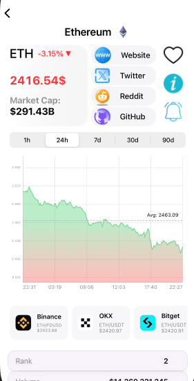
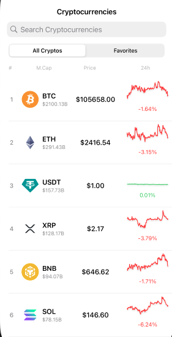

## 📱 Screenshots

  
  

# Crypto Moonitor

**Crypto Moonitor** is a modern and lightweight iOS application for tracking live cryptocurrency prices. It delivers real-time data, interactive price charts, exchange-level market pairs, and local price alerts in a clean and responsive interface.

## Features

- Real-time data for the top 100 cryptocurrencies via CoinGecko API  
- Inline mini-charts embedded directly in the main coin list  
- Interactive line charts with selectable time ranges (1h, 24h, 7d, 30d, 90d)  
- Favorites management with persistent local storage  
- Price alert functionality via local notifications  
- Background price polling using `BGTaskScheduler`  
- Exchange information and market pairs per cryptocurrency  
- Protocol-oriented architecture for testability and modularity  
- Clean, scalable codebase built with UIKit  

## Technologies Used

- Swift with UIKit  
- [CoinGecko API](https://www.coingecko.com/) — real-time cryptocurrency data  
- [Charts (DGCharts)](https://github.com/danielgindi/Charts) — line and mini-chart rendering  
- [SDWebImage](https://github.com/SDWebImage/SDWebImage) — asynchronous image loading and caching  
- UserNotifications — local notification scheduling  
- UserDefaults — lightweight persistent storage  
- BGTaskScheduler — background task execution  
- Protocol-oriented design — dependency injection and service abstraction  

## Architecture

The application is based on the MVC architecture, extended with protocol-driven service layers for better modularity.

### View Controllers

- `MainListVC` — renders the list of cryptocurrencies with price, change indicator, and mini-charts  
- `DetailedCryptoVC` — displays detailed information, price charts, historical data, and exchange markets  

### Services

- `APIService` — handles API calls and JSON decoding  
- `FavoritesManager` — manages user favorites using `UserDefaults`  
- `NotificationService` — abstracts local notification logic using a protocol (`NotificationManaging`)  
- `ChartService` — renders line chart data using DGCharts  
- `PriceAlertOperation` — background operation that fetches data and triggers price alerts  

### Protocols

- `NotificationManaging` — protocol for notification handling, allowing for dependency injection and mocking  
- More services are transitioning toward protocol-based architecture to enhance modularity and testability  

## Setup Instructions

1. Clone the repository  
2. Open `Crypto Moonitor.xcodeproj` in Xcode  
3. Build and run the app on a simulator or physical device  
4. No API key is required — CoinGecko's public API is free to use  

## Planned Enhancements

- Localization (English and Ukrainian)  
- Enhanced dark mode styling and accessibility support  
- Additional chart overlays: volume, moving averages  
- Migration toward MVVM pattern for improved scalability  

## Author

**Andrii Pyrskyi**  
GitHub: [@flerrr4ik](https://github.com/flerrr4ik)

---

**Disclaimer:** This project is intended for educational and demonstration purposes only. It is not a financial tool and should not be used for investment decisions.
